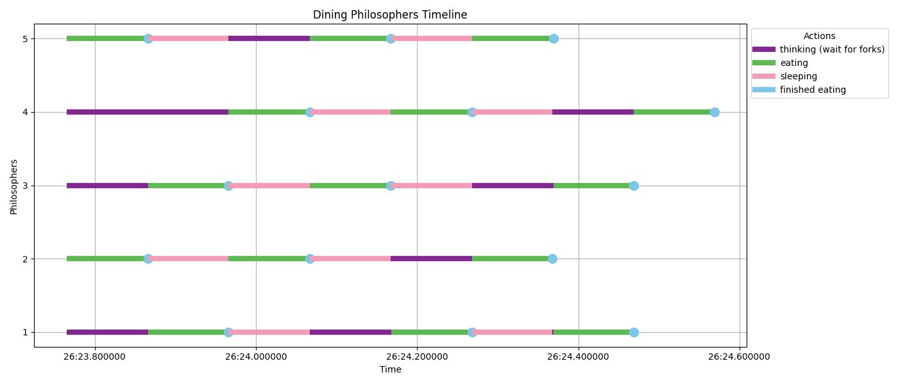

## 概要

### 目的

- この問題（Dining Philosophers Problem）は、リソース管理やデッドロックの回避など、並行処理プログラムの設計で重要な概念を学ぶためのものです。

### 問題の設定

- 5人の哲学者が円形のテーブルに座っています。
- テーブルには5つのフォークが配置されており、各哲学者の左右に1本ずつあります。
- 哲学者たちは、**考える**か**食事をするか**のどちらかを繰り返します。
- 食事をするには、左右のフォークを両方使う必要があります。

### 問題点

- 哲学者が同時にフォークを取ろうとすると、デッドロック（全員が待ち状態になり、進まなくなる）が発生する可能性があります。
- また、ある哲学者が常にフォークを取れない状況（飢餓状態）に陥ることもあります。

### 解決方法の例

- デッドロックを防ぐ方法
  - 全員が同時にフォークを取るのを防ぐために、哲学者が左右どちらのフォークを先に取るかを制御（例：奇数の哲学者は左、偶数は右から取る）

## 結果



Philosopherは左右のリソース（Fork）が使われていないときにしか食事（"eat"）ができていないことがわかりますね。

## 実装について

### 概要

- 哲学者の食事時間`eat()`と考える時間`think()`を設定し、それぞれの間に`waitForForks()`を挟んでいます。
  - 一般的なDishing Philosophers Problemの実装では以下のようになっています
    - `食事時間: 可変` -> `それ以外の時間（考える時間）: 可変`
    - Forkを持っていない時間はすべて考える時間としています
  - 42の課題では以下のようになっています
    - `食事時間: 固定` -> `考える時間: 可変` -> `睡眠: 固定` -> ...
    - 本実装ではこの方式で実装しています


### デッドロック防止

概要-解決方法の例で説明したように以下の手法でデッドロックを回避します

- 哲学者が左右どちらのフォークを先に取るのかを制御する
  - 奇数番号の哲学者は右→左の順番にフォークを取る
  - 偶数番号の哲学者は左→右の順番にフォークを取る

```go
func (p *Philosopher) think() {
	logAction(p.id, "thinking (waiting for forks)")
	waitStart := time.Now()

	if p.id%2 == 0 {
		// Odd philosophers pick the left fork first
		p.rightFork.Lock()
		p.leftFork.Lock()
	} else {
		// Even philosophers pick the right fork first
		p.leftFork.Lock()
		p.rightFork.Lock()
	}
    ...
}
```

### Go言語の利用機能

- `sync.Mutex`
  - 排他制御を行なうためにリソースをロックするための機能
  - 1つの処理だけがあるリソースにアクセスできるようにし、他の処理が同時にアクセスしてしまうことを防ぐ
  - 本実装
    - リソース: `fork[i]`
      - `philosopher`が`eat()`するために必要な`fork`。
      - `eat()`するためには`fork`が2本必要。
    - 処理: `philosopher.eat()`
- `sync.WaitGroup`
  - 複数のgoroutineが終了するまで待機するためのカウンタ
```go
func (p *Philosopher) dine(wg *sync.WaitGroup) {
    // deferを利用して、この関数が終了したときに呼ばれるようにする。
	// 終了するごとにカウントを1減らす
	defer wg.Done()
        ...
}

...

func main () {
	...
	for i := 0; i < numPhilosophers; i++ {
		...
		wg.Add(1) // 処理の数（哲学者の数、Threadの数）分だけカウントする
		go philosophers[i].dine(&wg)
	}
}
```

